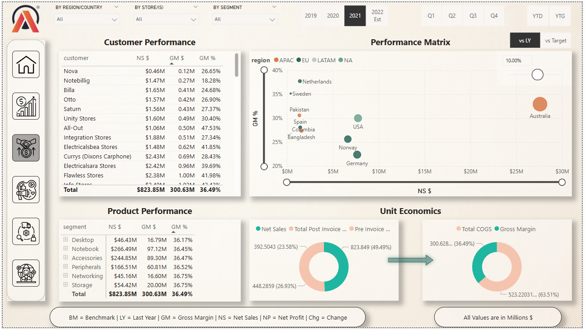
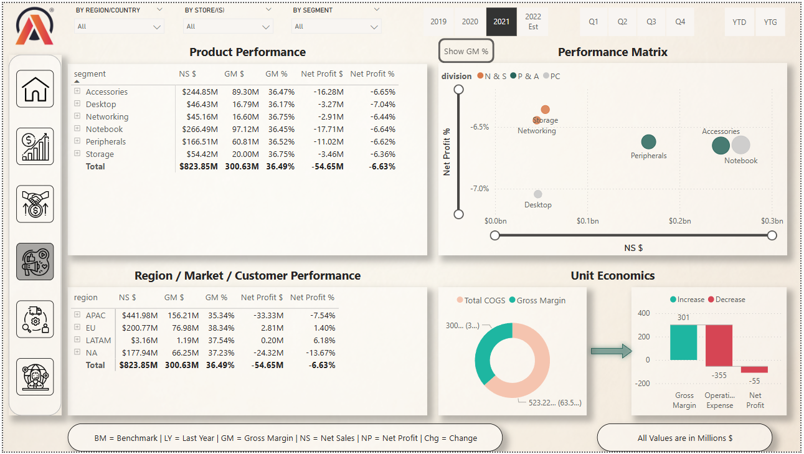
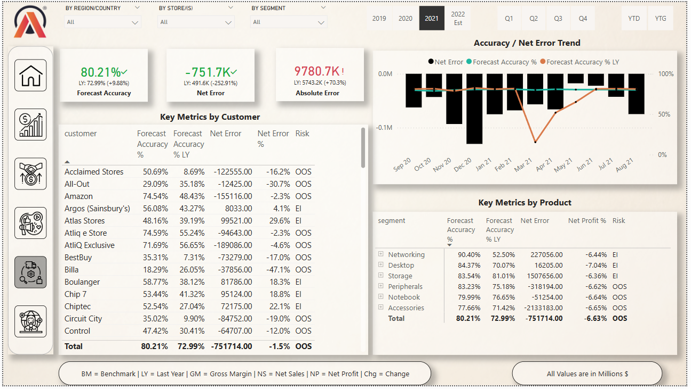
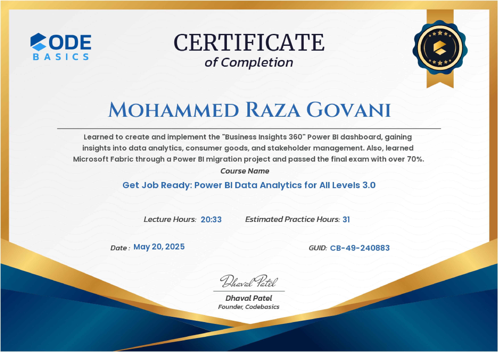

# 📊 Business Insights 360 – Power BI Project

A comprehensive end-to-end **Power BI** project developed as part of the **Codebasics Data Analytics Bootcamp**. The project simulates a real-world dashboard for a fictional company – *AtliQ Hardware*, enabling executives to gain actionable insights into **Finance, Sales, Marketing, Supply Chain**, and overall **Business Performance**.

---

## 🎯 Objective

To analyze business performance across departments and provide insights to stakeholders using an interactive Power BI dashboard. The project includes:
- Data extraction from MySQL
- Power Query transformations
- Star schema data modeling
- DAX for KPIs
- Dynamic visuals and storytelling

---

## 🛠 Tools & Technologies

- **Power BI**
- **DAX (Data Analysis Expressions)**
- **Power Query**
- **Star Schema Modeling**
- **MySQL** (Data source simulation)
- **Excel** (for minor formatting)
- **Microsoft Fabric** (conceptual migration overview)

---

## 📁 Folder Structure

```bash
📁 Business-Insights-360
├── 📁 pbix
│   └── BI 360 Dashboard.pbix
├── 📁 project-video
│   └── PowerBi-Portfolio-Project_Business-Insights-360.mp4
├── 📁 screenshots
│   ├── Home.png
│   ├── Info.png
│   ├── finance-view.png
│   ├── sales-view.png
│   ├── marketing-view.png
│   └── supply-chain-view.png
│   └── executive-view.png
│   └── data-model.png
│   └── Support.png
├── certificate.jpg
└── README.md
```

---

## 📸 Dashboard Screenshots

### 🔹 Executive Overview  


### 🔹 Finance Dashboard  


### 🔹 Sales Dashboard  


### 🔹 Marketing Dashboard  


### 🔹 Supply Chain Dashboard  


---

## 🔍 Key KPIs and Insights

- 🔢 **Gross Margin, Operating Margin, Net Profit**
- 🧮 **YOY Revenue Growth**
- 🛍️ **Top-Selling Products and Categories**
- 📍 **Regional Sales Trends**
- 🏭 **Production Efficiency Metrics**
- 📈 **Campaign Effectiveness**
- 🧑‍💼 **Executive-Level Performance Summary**

---

## 📽️ Project Demo Video

🎥 [Click here to watch the full project demo](/project-video/PowerBi-Portfolio-Project_Business-Insights-360.mp4)

---

## 🏅 Certificate of Completion

This project was completed as part of the **“Get Job Ready: Power BI Data Analytics for All Levels 3.0”** course by Codebasics. I successfully passed the final exam and submitted the capstone project.



---

## 📚 What I Learned

✅ Business problem-solving with data  
✅ Power BI data modeling best practices  
✅ End-to-end dashboard development  
✅ Storytelling through visuals  
✅ Hands-on use of DAX and Power Query  
✅ Stakeholder-centric design thinking  
✅ Microsoft Fabric basics and migration overview  

---

## 🙏 Special Thanks

A big thanks to the **Codebasics** team for creating such an incredible bootcamp that blends theory with practical, real-world projects.  
Special thanks to:
- **Dhaval Patel** for his practical teaching style  
- **Hemanand** for guidance on business use cases and stakeholder thinking  

---

## 🌐 Connect with Me

- **LinkedIn**: [linkedin.com/in/razagovani](https://linkedin.com/in/razagovani)
- **GitHub**: [github.com/gRaza25](https://github.com/gRaza25)
- **Email**: mohammedgovani18@gmail.com

---
